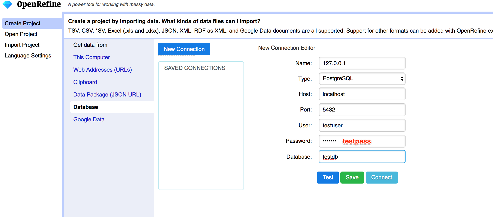
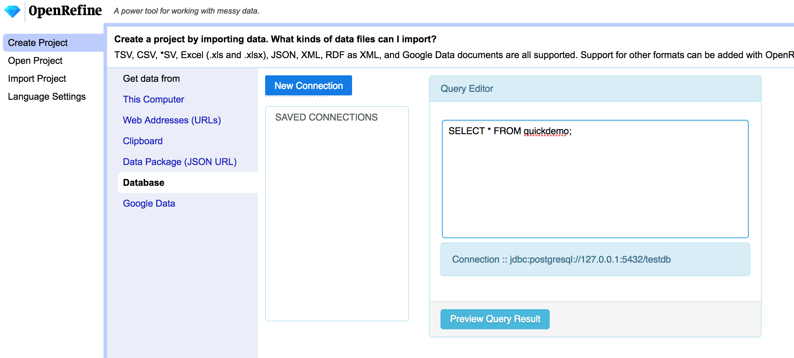

# jupyterserverproxy-openrefine
Jupyter-server-proxy config for running OpenRefine

Start on Jupyter notebook homepage: 

Start in OpenRefine client: 

This `pgdemo` branch demonstrates:

- using serverproxy (traitlet definition) to add an *OpenRefine* menu option to the notebook start menu. The configuration uses a fixed port assigment so that we can work with the client package.
- postgres running in the Binder image.

To log in to Postgres:

- select new database;
- use credentials:
  - server: 
  - port: `5432`
  - user: `testuser`
  - password: `testpass`
  - database: `testdb`
  
  

  - sample query: `SELECT * FROM quickdemo;`
  
 

When you run the query it should take you into a create new project preview.
  

The OpenRefine client can be found on the `openrefine` path or on a path explictly via the predefined port (`proxy/3333/`).

Calling the path directly (eg starting MyBinder with the path `openrefine`, or adding `?urlpath=openrefine` to the Bunder URL) will launch the Binder container directly into the OpenRefine GUI application.

Note that the currently installed Python Openrefine client (an old Py3 port) may not work with this version of OpenRefine.
